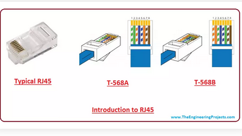

**RJ45**
>RJ stands for Registered Jack, a standardized physical interface for connecting telecommunications devices.
>The "45" part refers to the specific pinout and configuration used for the connector.RJ45" is essentially a standardized connector and socket for Ethernet cables.
>>Ethernet cables that use RJ45 connectors are usually referred to as Cat5e, Cat6, Cat6a, or Cat7 cables, depending on their specifications. These cables are typically made with twisted-pair wiring (pairs of insulated copper wires twisted together to reduce interference).

**Features of an RJ45 Connector:**
1. **Pins:**
>>It has 8 pins (contacts) that correspond to 8 wires inside the Ethernet cable. These pins are used to send and receive electrical signals.
2. **Size and Shape:**
>>RJ45 connectors are relatively small and rectangular. They have a clip at the end to securely latch into an RJ45 jack or port.
3. **Cabling Types:**
>>**Straight-through cables:** This is the most common type. The wiring inside the cable is the same on both ends, connecting each pin to its corresponding one.

>>**Crossover cables:** Here, the wiring is crossed on each end, meaning pin 1 goes to pin 3, pin 2 to pin 6, etc. This is used for connecting similar devices (e.g., two computers directly without a switch).

>>
4. **Speed and Performance:**
>>RJ45 connectors can support various Ethernet standards, ranging from 10/100 Mbps (Fast Ethernet) to 1 Gbps (Gigabit Ethernet) and even up to 10 Gbps (with higher-quality cables like Cat6a or Cat7).

**Inside the Cable: Twisted-Pair Wiring**
>>Ethernet cables usually consist of four twisted pairs of wires. These twisted pairs help reduce electromagnetic interference (EMI) from external sources, ensuring a cleaner and faster signal. The standard color-coding for the twisted pairs is:
1. Pair 1: White/Blue and Blue
2. Pair 2: White/Orange and Orange
3. Pair 3: White/Green and Green
4. Pair 4: White/Brown and Brown

**Common Uses:**
>>**Networking:** RJ45 connectors are used to connect devices to local area networks (LANs), such as between computers, routers, and switches.
>>**Home Internet:** You often see them in homes and offices for wired internet connections, especially with faster and more reliable speeds compared to Wi-Fi.

**Difference between Straight-through cables and Crossover cables**

**Straight-Through Cable:**
>**Purpose:** Used to connect different types of devices (e.g., a computer to a switch/router, or a switch to a router).

>**Wiring:** The wiring is the same on both ends. Each pin on one end connects directly to the same pin on the other end.

**How it works:**
* Pin 1 connects to Pin 1
* Pin 2 connects to Pin 2
* Pin 3 connects to Pin 3
* … and so on for all 8 pins.
**image of straight throught cables**
**Common Use:**
* Connecting a PC to a switch or hub
* Connecting a switch to a router

**Crossover Cable**
> **Purpose:** Used to connect similar devices directly (e.g., computer to computer, switch to switch, or router to router) without needing a hub or switch.

>**Wiring:** The transmit and receive pairs are swapped on one end to allow the devices to communicate directly.

**How it works:**
* Pin 1 connects to Pin 3
* Pin 2 connects to Pin 6
* Pin 3 connects to Pin 1
* Pin 6 connects to Pin 2
* Pins 4, 5, 7, and 8 remain the same.
**image of Crossover cables:**

**Common Use:**
* Connecting two computers directly (without a switch)
* Connecting two switches directly
 
| Feature              | Straight-Through Cable                         | Crossover Cable                              |
|----------------------|-----------------------------------------------|----------------------------------------------|
| **Used to connect**  | Different device types (PC to switch, switch to router) | Same device types (PC to PC, switch to switch) |
| **Wiring on ends**  | Both ends wired the same way                    | One end swaps transmit and receive pairs     |
| **Pins swapped**    | No                                             | Yes (Pins 1 & 3, 2 & 6)                       |
| **Common use case** | Normal network setups                           | Direct device-to-device connections without a hub |
